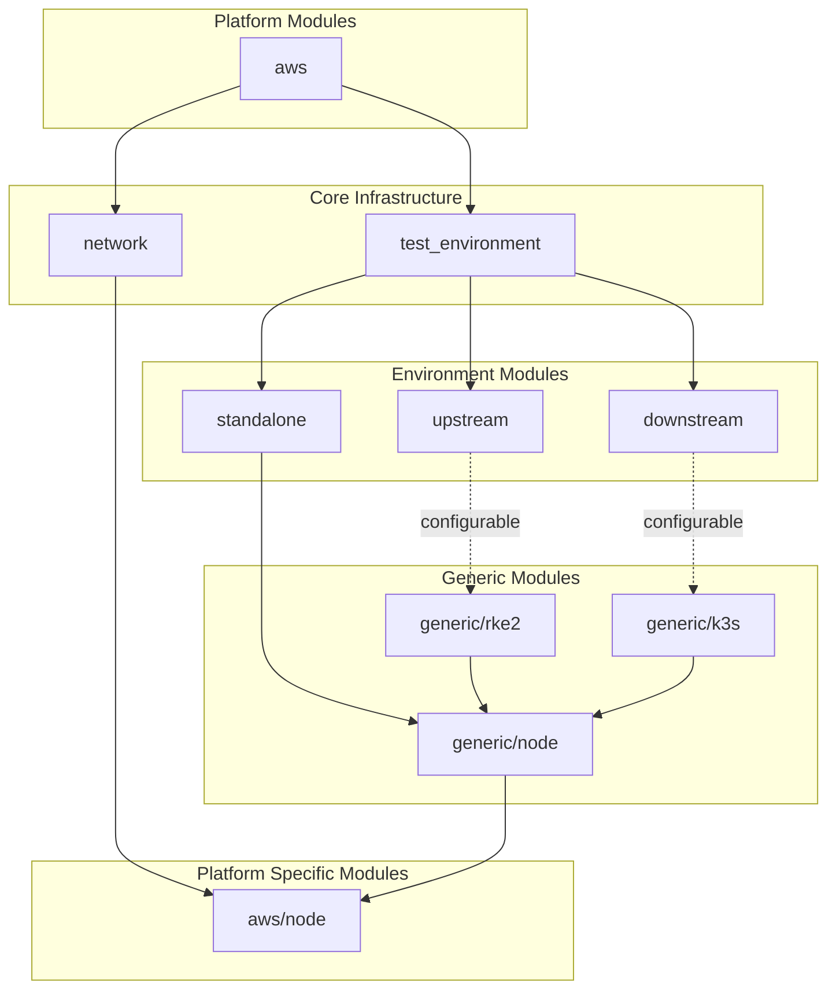

# Developer notes

## Prerequisites

Before contributing to this project, ensure you have the following tools installed:

### Required Tools

- **Go** (version specified in `go.mod`): [Installation instructions](https://go.dev/doc/install)
- **Make**: Usually pre-installed on Linux/macOS. For Windows, use [GnuWin32](http://gnuwin32.sourceforge.net/packages/make.htm) or WSL.
- **golangci-lint** (v2.5+): [Installation instructions](https://golangci-lint.run/welcome/install/)
  ```bash
  # Quick install (Linux/macOS)
  curl -sSfL https://raw.githubusercontent.com/golangci/golangci-lint/HEAD/install.sh | sh -s -- -b $(go env GOPATH)/bin
  ```

### Optional Tools

- **pre-commit**: For automatic pre-commit hooks. [Installation instructions](https://pre-commit.com/#install)
  ```bash
  pip install pre-commit
  pre-commit install
  ```

## Validating Your Changes

Before submitting a pull request, run the following commands to ensure your changes pass all checks:

### Go Code Verification

```bash
# Verify Go modules are tidy and consistent
make go-mod-verify

# Build the project
make build

# Run Go linter
make lint

# Run all Go verification steps (go-mod-verify + build + lint)
make verify
```

### OpenTofu Verification

```bash
# Check OpenTofu formatting
make tofu-fmt-check

# Auto-format OpenTofu files
make tofu-fmt

# Validate all OpenTofu configurations
make tofu-validate

# Run all OpenTofu verification steps
make verify-tofu
```

### Full Verification

```bash
# Run all verification steps (Go + OpenTofu)
make verify-all
```

## Overall architecture

For SUSE internal projects please see the [internal design document](https://docs.google.com/document/d/1-jgzGSmeH47mobXycuOgeg1W_wTB4AgY).

For all uses, this project is composed of:
 - [OpenTofu](http://opentofu.org) modules to deploy infrastructure. That includes all is necessary in order to launch Kubernetes clusters - modules should conclude producing a kubeconfig file and context
 - the `dartboard` Golang program
   - runs OpenTofu to create Kubernetes clusters
   - uses Helm/kubectl to deploy and configure software under test (Rancher and/or any other component)
   - uses Helm/kubectl to deploy and configure test software (Mimir, Grafana, k6, etc.)

Specifically:
 - `dartboard apply` is a `dartboard` subcommand that calls OpenTofu to deploy Kubernetes clusters. Outputs kubeconfig files and build-specific parameters. Created clusters are:
   - upstream: where Rancher is installed
   - downstream: that is imported into Rancher (can be zero or more)
   - tester: where load testing/benchmarking/metric collection tools will run
 - `dartboard deploy` is a `dartboard` subcommand that:
   - calls `dartboard apply` to create clusters
   - installs Rancher via Helm in the upstream cluster
   - configures Rancher by creating basic objects (eg. users)
   - imports downstream clusters created by dartboard apply into Rancher with Shepherd
 - `dartboard test` is a `dartboard` subcommand that runs `k6` from a pod in the tester cluster
 - `dartboard destroy` is a `dartboard` subcommand that calls OpenTofu to destroy clusters created by `dartboard apply`
 - k6 is used to benchmark APIs in the upstream or downstream clusters, sending metrics to mimir. Runs in the tester cluster
 - mimir is used to collect metrics from test runs (from k6 and instrumentation of the SUT, aka rancher-monitoring). Runs in the tester cluster. Allows for bulk data export in Prometheus format for later analysis. Plan is to store long-term data in a new Mimir + Grafana installation managed by the QA team

## OpenTofu module specifics

In this project modules are organized according to these rules:
 - `tofu/main/*` contains the main `tf` files that specify whole testing environments
   - there is one subdirectory per platform (eg. `aws`, `azure`, `harvester`)
 - `tofu/modules` contains reusable modules that can be used in multiple environments
   - modules in the `tofu/modules/generic` directory are platform-agnostic
   - modules in other directories are platform-specific (eg. `aws`, `azure`, `harvester`)
 - modules are consistently named according to the concept they represent:
   - **node**: a Linux VM capable of SSH login
     - `node_variables` is a block of variables passed as-is from main to a platform-specific node module. It contains all details to create the VM that are specific to that one VM
   - **cluster**: a Kubernetes cluster - possibly a set of nodes with a distribution installed, or a managed service
   - **network**: anything that is shared among clusters and nodes and allows them to work together (actual networks, firewalls, rules, bastion hosts...)
      - `network_configuration` is a block of outputs passed as-is from a platform-specific network module to node modules of the same platform. It contains details that are common to all VMs
   - **test environment**: an upstream cluster, any number of downstream clusters and a tester cluster, all glued together with a single network
   - everything else, typically generic software that can be installed onto nodes

Assumptions:
 - Deployed nodes and clusters are reachable either directly or via an SSH bastion host from the machine running OpenTofu
 - Deployed nodes and clusters will be able to reach one another with the same domain names, from the same network. That network might not be the same network of the machine running OpenTofu
 - Deployed clusters may or may not be directly reachable from the machine running OpenTofu. In the current `aws` implementation, for example, all access goes through an SSH bastion host and tunnels, but that is an implementation detail and may change in future. For new platforms there is no requirement - clusters might be directly reachable with an Internet-accessible FQDN, or be behind a bastion host, Tailscale, Boundary or other mechanism



## Vendored binaries

Dartboard vendors binaries it uses like OpenTofu, kubectl and Helm. These are decompressed and stored in the `.bin` directory at runtime.

## Dart files

YAML files in the `darts/` subdirectory represent full environments and contain all configuration to run a test. That includes:
 - `tofu_main_directory`: a pointer to a main directory for OpenTofu modules
 - `tofu_variables`: a block of variables passed as-is to OpenTofu
 - any other test-specific variables

## Hacks and workarounds

In some situations we want to add code which "uncleanly" works around bugs in other software or limitations of some kind. Those can be discussed in the PR on a case-by-case basis, but they have to be documented with a comment starting with `HACK:`, so that they can be tracked later, eg.:

https://github.com/search?q=repo%3Amoio%2Fscalability-tests+HACK%3A&type=code

If at all possible, also include a condition for the removal of the hack (eg. dependency is updated to a version that fixes a certain issue).

## CI Architecture and Future Improvements

The CI is organized into separate workflow files for different concerns:

- `go-verification.yml`: Go module verification, build, and linting
- `tofu-verification.yml`: OpenTofu format checking and validation
- `k3d-smoke-test.yml`: Integration testing with k3d
- `release.yml`: Release automation with GoReleaser

### Potential Future Improvements

1. **Parallel job optimization**: The Go verification workflow runs three separate jobs. Consider adding a combined job that runs `make verify` for faster feedback on simple changes, while keeping separate jobs for clearer failure isolation.

2. **Caching**: Add Go module and build caching to speed up CI runs. The current configuration disables caching but this could be re-enabled with proper cache invalidation.

3. **Matrix builds**: Consider testing against multiple Go versions if backward compatibility is important.

4. **Reusable workflows**: Extract common setup steps (checkout, Go setup) into reusable workflows to reduce duplication.

5. **Dependency updates**: The pre-commit hooks reference golangci-lint v1.57.2 while CI uses v2.5. Consider synchronizing these versions.

6. **Test coverage**: Add a test target to the Makefile and CI workflow when Go tests are added to the project.

7. **Documentation validation**: Add markdown linting or link checking for documentation files.
