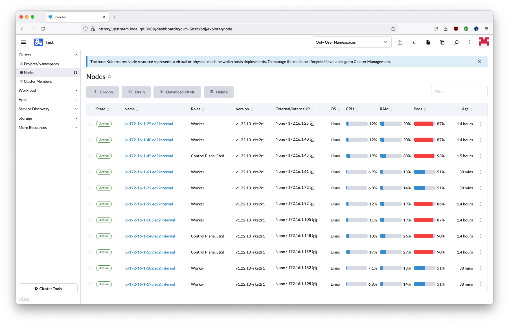
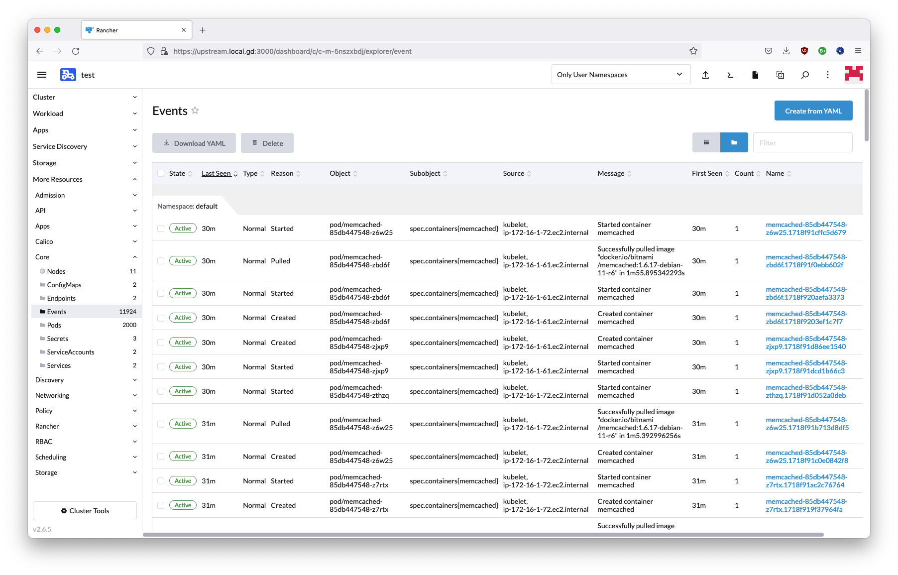

# 2022-09-28 - 250 pods per node test (with cluster operations)

## Results

- [results from the 20220923 test were reproduced](./20220923%20-%20250%20pods%20per%20node.md), then:
- 4 worker nodes were added and the number of replicas was scaled up to 2000
  - workload stayed healthy as per above
- 1 worker node was cordoned, drained and removed via the Rancher UI
  - workload stayed healthy as per above
- all RKE2 nodes were upgraded to the next RKE2 minor version
  - workload stayed healthy as per above

The test takes ~1 hour and costs ~2 USD in AWS resources.

## AWS Hardware configuration

- bastion host (for SSH tunnelling only): t2.micro, 50 GiB EBS gp3 root volume
- Rancher cluster: 3-node t3.large, 50 GiB EBS gp3 root volume
- downstream cluster: from 7 up to 11 nodes t3.xlarge, 50 GiB EBS gp3 root volume
- networking: one /16 AWS VPC with two /24 subnets
  - public subnet: contains the one bastion host which exposes port 22 to the Internet via security groups
  - private subnet: contains all other nodes. Traffic allowed only internally and to/from the bastion via SSH

See https://aws.amazon.com/ec2/instance-types/, https://aws.amazon.com/ebs/, https://aws.amazon.com/vpc/ 

## Software configuration

- bastion host: SLES 15 SP4
- Rancher cluster: Rancher 2.6.5 on a 3-node RKE2 v1.23.10+rke2r1 cluster
    - all nodes based on Rocky Linux 8.6
- downstream cluster: RKE2 v1.22.13+rke2r1, 3 server nodes and 4 agent nodes
  - all nodes based on Rocky Linux 8.6

The number of 250 pods per node is set by:
- adding a `kubelet-arg: "config=/etc/rancher/rke2/kubelet-custom.config"` line to `/etc/rancher/rke2/config.yaml`
- creating a `/etc/rancher/rke2/kubelet-custom.config` file with the following content:
```yaml
apiVersion: kubelet.config.k8s.io/v1beta1
kind: KubeletConfiguration
maxPods: 250
```
- restarting the `rke2-server` service

See [the rke2 installation script in this repo](../rke2/install_rke2.sh) for details.

## Full configuration details

All infrastructure is defined via [Terraform](https://www.terraform.io/) files in the [20220928_250_pods_per_node_with_cluster_operations](https://github.com/moio/scalability-tests/tree/20220928_250_pods_per_node_with_cluster_operations) branch.

Note in particular [inputs.tf](../inputs.tf) for the main parameters.

## Reproduction Instructions
 
### Deployment and cluster configuration

- get API access to EC2 configured for your terminal
    - for SUSE Engineering:
        - [have "AWS Landing Zone" added to your Okta account](https://confluence.suse.com/display/CCOE/Requesting+AWS+Access)
        - open [Okta](https://suse.okta.com/) -> "AWS Landing Zone"
        - Click on "AWS Account" -> your account -> "Command line or programmatic access" -> click to copy commands under "Option 1: Set AWS environment variables"
        - paste contents in terminal
- get [Terraform](https://www.terraform.io/downloads)
- check out this project
```shell
git clone https://github.com/moio/scalability-tests.git
cd scalability-tests
git checkout 20220928_250_pods_per_node_with_cluster_operations
```
- run:

```shell
terraform init
terraform apply -auto-approve
```

- deployment takes ~10 minutes
- output will contain instructions to access the newly created clusters, eg.
```
UPSTREAM CLUSTER ACCESS:
  export KUBECONFIG=./config/upstream.yaml

RANCHER UI:
  https://upstream.local.gd:3000

DOWNSTREAM CLUSTER ACCESS:
  export KUBECONFIG=./config/downstream.yaml
```
- use the URL to access the Rancher UI, login with `admin` as temporary password
- "Clusters" -> "Import existing" -> "Generic" -> "Cluster Name": test -> "Create"
- click on the `curl` command to copy it
- SSH into the first node running `./config/ssh-to-*-downstream-server-node-0.sh`
- paste the `curl` command to register the cluster to Rancher
- wait until the cluster is fully registered, check that all 7 nodes are detected with a maximum number of 1750 pods visible from the home page

### Workload deployment

- Homepage -> test -> "Apps" -> "Repositories" -> "Create"
    - "Name": bitnami
    - "Index URL": `https://charts.bitnami.com/bitnami`
    - click on "Create"
- "Apps" -> "Charts" -> "memcached"
    - "Chart Versions": 6.2.5
    - click on "Install"
    - "Name": memcached
    - click on "Next" -> "Install"
    - "Workload" -> "Deployments" -> memcached -> "⋮" -> "Edit YAML"
    - "Edit YAML":
        - `spec.replicas`: change from 1 to 1500
        - remove the `resources` dictionary (`resources:` line and the three following lines) 
    - click on "Save"
- wait for deployment to stabilize (it could take several minutes) and check events on the "Cluster Dashboard" page, there should not be errors after the cluster settles at ~1550 / 1750 active pods
  - note that the UI might display outdated information temporarily. If pods are shown as errored when they should not, try refreshing the page

### Adding cluster nodes

- edit `inputs.tf` and edit `downstream_agent_count` from 4 to 8
- run `terraform apply -auto-approve` again
  - monitor the "Cluster" -> "Nodes" page. New nodes should appear during deployment
- pod cluster capacity in the "Cluster" page should increase from  1750 to 2750
- scale the number of replicas up from 1500 to 2000 per instructions in the previous paragraph
    - monitor the "Cluster" -> "Nodes" page. Newly added nodes pod count should raise up to ~51%
- check the health indicator from the "Workload" -> "Deployments" -> memcached page and events from the "More Resources" -> "Core" -> "Events" page

### Removing cluster nodes

- Drain a worker node: "Cluster" -> "Nodes" -> worker node -> "⋮" -> "Drain" -> "Drain"
  - "Delete Empty Dir Data": Yes
  - "Force": Yes
  - "Ignore the defaults and give each pod": 5 seconds
- check the health indicator from the "Workload" -> "Deployments" -> memcached. 2000 pods should remain available
- Delete that worker node: "Cluster" -> "Nodes" -> worker node -> "⋮" -> "Delete" -> "Delete"
- reload the page. The number of nodes should now be 10

### Upgrading RKE2

Methodology notes:
 - RKE2 upgrade in the downstream cluster is performed via the [installation script method](https://github.com/rancher/rke2/blob/v1.25.2%2Brke2r1/docs/upgrade/basic_upgrade.md#upgrade-rke2-using-the-installation-script) because it's the only option with imported clusters
 - the cluster is imported, in turn, because AWS provisioning [is not supported with temporary session tokens at the time of writing](https://github.com/rancher/rancher/issues/15962)
 - upgrades via installation scripts imply draining nodes that are being upgraded. That in turn implies that the cluster must have sufficient pod capacity overall - considering one node at a time will be drained
 - at the beginning of this step, there are 2000 workload pods per 10 nodes, averaging 200 per node - draining one node would imply 222 workload pods per node, which could easily exceed the maximum of 50 considering ~34 system pods per node
 - the number of replicas is thus scaled down to 1000, so that the number of workload pods per node is 111, ~143 considering system pods. The number is still surely higher than the default of 110, which is the objective of this test

- scale the number of replicas down from 2000 to 1000 per instructions in the previous paragraph
    - monitor the "Cluster" -> "Nodes" page. Pod pressure should diminish
- run `./util/upgrade_downstream_rke.sh`
  - monitor the "Cluster" -> "Nodes" page. Nodes should be cordoned and uncordoned, starting from server nodes, one by one
  - monitor the "Workload" -> "Deployments" -> memcached page. Upon node draining, the number of available pods should diminish and then be replenished to 1000
- at the end of the process, the "Cluster" -> "Nodes" page should show the new RKE2 version on all nodes (v1.23.10+rke2r1), and an even pod load distribution
- finally check the health indicator from the "Workload" -> "Deployments" -> memcached page and events from the "More Resources" -> "Core" -> "Events" page

### Cleanup

All created infrastructure can be destroyed via:
```shell
terraform destroy -auto-approve
```

## Screenshots







## Troubleshooting
- to re-create SSH tunnels to the cluster, use `terraform apply` again

- if the error below is produced:
```
Error: creating EC2 Instance: VcpuLimitExceeded: You have requested more vCPU capacity than your current vCPU limit of 32 allows for the instance bucket that the specified instance type belongs to. Please visit http://aws.amazon.com/contact-us/ec2-request to request an adjustment to this limit.
```

Then you need to request higher limits for your account to AWS. This can be done by visting [the Service Quotas](https://console.aws.amazon.com/servicequotas/home) page and filling the details to request an increase of the "Running On-Demand Standard (A, C, D, H, I, M, R, T, Z) instances" limit.
