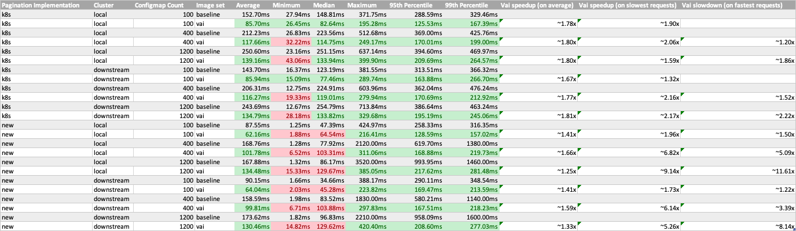
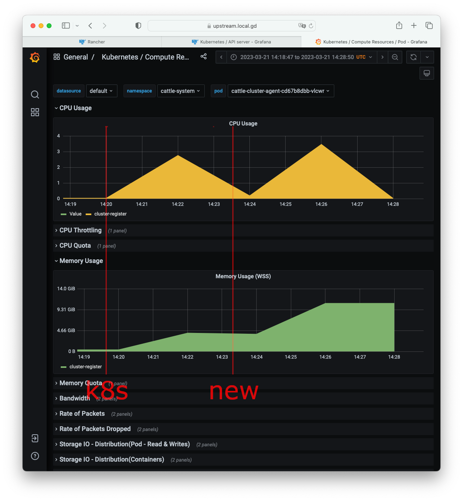
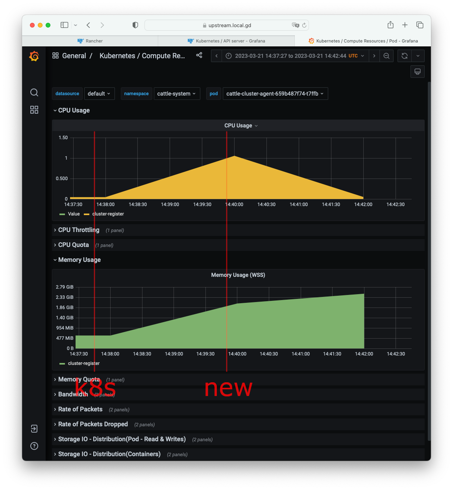
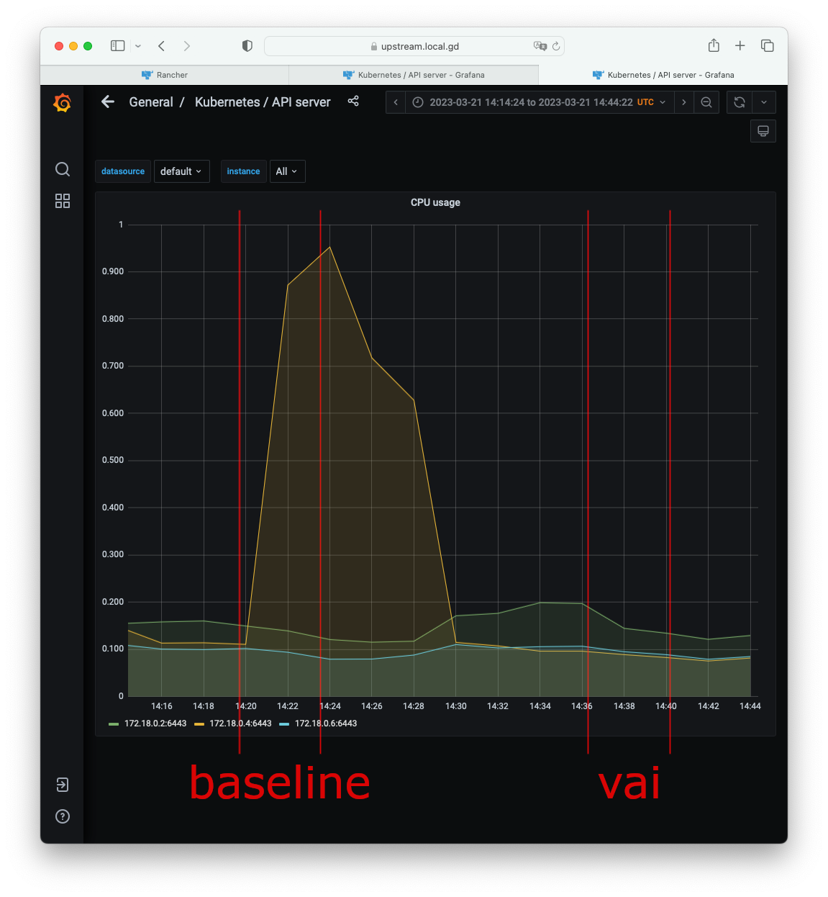

# 2023-03-06 - Steve and Vai tests

## Results

Under test conditions, according to collected measures described below:

- vai-patched images improved *average http request duration* when listing ConfigMaps using pagination
  - **~65%-80% speedup** observed when using k8s-based pagination (`limit`/`continue`, currently used by the [dashboard](https://github.com/rancher/dashboard/) UI)
  - **~25%-66% speedup** observed when using the new Steve-cached pagination (`page`/`pagesize`)
  - speedups varied within ranges above depending on whether the cluster was local or downstream, and depending on the number and size of resources listed
- vai improved worst-case durations, while penalizing best-case durations, suggesting a distribution with less variance. This is consistent with expectations as vai uses an on-disk cache while current code uses an in-RAM cache, thereby penalizing the fastest case, while on the other hand needing less re-listing of resources from the Kubernetes API, thereby improving on the slowest case
- vai used less RAM (~2 GiB instead of ~10 GiB in one test). This is consistent with expectations, as vai uses an on-disk cache
- vai decreased CPU load on `kubeapi-server` (1 core in one test). This is consistent with expectations, as vai needs less re-listing of resources from the Kubernetes API

- As a side effect of this research, a 10-virtual-user smoke test revealed a [race condition in Steve](https://github.com/rancher/rancher/issues/40892), then [fixed](https://github.com/rancher/steve/pull/80/).

## Hardware and infrastructure configuration outline

- two k3d clusters (one local and one downstream)
  - each cluster with 3 nodes (forcing etcd-based storage)
  - backing hardware: one Lenovo ThinkPad P51 laptop (circa 2017)
    - Intel(R) Core(TM) i7-7820HQ CPU @ 2.90GHz, 8 vCPUs
    - 32 GiB RAM
    - SSD local storage
- k6 load generator running on another laptop on the same wired local network

## Process outline

- infrastructure setup:
  - create a k3d cluster, install Rancher on it. Create an empty k3d downstream cluster
  - build patched Rancher images
  - configure Rancher, import the downstream cluster
- for each test:
  - run script to generate a number of ConfigMaps
  - swap images with patched ones
  - run load test script, record results

## Full configuration details

All infrastructure is defined in [Terraform](https://www.terraform.io/) files in the [20230306_steve_vai_tests](https://github.com/moio/scalability-tests/tree/20230306_steve_vai_tests/terraform) branch.

[k6](https://k6.io) load test scripts are defined in the [k6](https://github.com/moio/scalability-tests/tree/20230306_steve_vai_tests/k6) directory.

## Reproduction Instructions

### Requirements

- docker
- [Terraform](https://www.terraform.io/downloads)
- `git`
- `nc` (netcat)
- `make`
- [k6](https://k6.io)

### Setup

Deploy the k3d infrastructure and install Rancher:
```shell
# clone this project
git clone https://github.com/moio/scalability-tests.git
cd scalability-tests
git checkout 20230306_steve_vai_tests

# initialize Terraform
cd terraform
terraform init

# deploy
terraform apply -auto-approve
````

Build patched images and import them into k3d clusters:
```shell
# build Rancher from the [moio/fix_lru_concurrent_map_write](https://github.com/moio/rancher/tree/fix_lru_concurrent_map_write) branch
git clone https://github.com/moio/rancher.git
cd rancher
git checkout fix_lru_concurrent_map_write

cat >scripts/quickbuild <<"EOF"
#!/bin/bash
set -e

cd $(dirname $0)

./build
./package
EOF
chmod +x scripts/quickbuild

TAG=baseline make quickbuild

# build Rancher again from the [moio/steve-vai](https://github.com/moio/rancher/tree/steve_vai) branch
git checkout steve_vai
TAG=vai make quickbuild

# import built images into clusters
k3d image import --mode direct --cluster moio-upstream rancher/rancher:baseline
k3d image import --mode direct --cluster moio-downstream rancher/rancher-agent:baseline
k3d image import --mode direct --cluster moio-upstream rancher/rancher:vai
k3d image import --mode direct --cluster moio-downstream rancher/rancher-agent:vai
```

Configure Rancher and import the downstream cluster:
 - log in (https://upstream.local.gd:8443) with bootstrap password `admin`
 - create the admin user's password (eg. `adminadminadmin`)
 - import the downstream cluster as generic cluster appending `--context=k3d-moio-downstream` to the end of the command
   - eg. `curl --insecure -sfL https://upstream.local.gd:8443/v3/import/LONG_LONG_TOKEN_HERE.yaml | kubectl apply -f - --context=k3d-moio-downstream`

All created infrastructure can be destroyed at the end of the test via:
```shell
terraform destroy -auto-approve
```

### Test 1: benchmark pagination implementations, interpret duration results

#### Outline
First, we create a given number of ConfigMaps in a test namespace via a k6 script. Each ConfigMap is created with 10 kb of data payload.

Then, we simulate 10 virtual users listing all ConfigMaps in that namespace via another k6 script. Each user will repeat the listing 30 times (for statistical accuracy of measures). The page size is of 100, like in the current UI. We exercise both the k8s based pagination implementation, using the `limit`/`continue` parameters and currently used by the [dashboard](https://github.com/rancher/dashboard/) UI, as well as the new Steve-cache pagination implementation using the `page`/`pagesize` parameters. We test both local and downstream cluster.

#### Procedure

Run this command to create dummy ConfigMaps:
```shell
k6 run -e KUBECONFIG=`realpath ~/.kube/config` -e CONTEXT=$CONTEXT -e COUNT=$COUNT ./create_config_maps.js
```
Variables:
 - `$CONTEXT`: use either `k3d-moio-upstream` for the local cluster or `k3d-moio-downstream` for the downstream one
 - `$COUNT`: the number of ConfigMaps to create

Run this command to swap Rancher and agent images to patched ones:
```shell
kubectl --context=k3d-moio-upstream set image -n cattle-system deployment/rancher rancher=rancher/rancher:$TAG
kubectl --context=k3d-moio-downstream set image -n cattle-system deployment/cattle-cluster-agent cluster-register=rancher/rancher-agent:$TAG
```
Variables:
- `$TAG`: use `v2.7.1` for vanilla Rancher 2.7.1, `baseline` for 2.7.1 with a [fix](https://github.com/rancher/steve/pull/80/) for a [race condition](https://github.com/rancher/rancher/issues/40892) discovered during tests and `vai` for 2.7.1 with Vai patches

Run this command to benchmark:
```shell
k6 run -e VUS=10 -e PER_VU_ITERATIONS=30 -e BASEURL=https://upstream.local.gd:8443 -e USERNAME=admin -e PASSWORD=adminadminadmin -e CLUSTER=$CLUSTER ./$TEST.js
```
- `$CLUSTER`: use either `local` for the local cluster or a cluster id (eg. `-e CLUSTER=c-m-q5ppjmfc`) for the downstream cluster
- `$TEST`: use either `load_steve_k8s_pagination` for k8s-based pagination or `load_steve_new_pagination` for the new Steve-cache pagination implementation


Interpreting results: k6 will output several values. For this analysis most interesting are `http_req_duration` metric statistics:
```
     http_req_duration..............: avg=98.7ms   min=10.79ms  med=94.62ms  max=284.48ms p(95)=175.11ms p(99)=210.48ms count=901
```
In the example above, retrieving a page up to 100 resources from the local cluster took **98.7ms** on average - 10.79ms best case, 94.62ms median case (~50% of samples fell below this number and ~50% above), 284.48ms worst case. p(95) indicates that 95% of requests took less than 175.11ms, and p(99) indicates that 99% took 210.48ms or less. In general, lower values are better.

[A `test_runner.sh` script is provided in the util directory](../util/test_runner.sh) to automate multiple runs.

#### Analysis of results

Full results are available in the [20230306 - steve vai test results](https://github.com/moio/scalability-tests/tree/20230306_steve_vai_tests/docs/20230306%20-%20steve%20vai%20test%20results) directory, summary is in the table below:


An [Excel file](https://mysuse-my.sharepoint.com/:x:/g/personal/moio_suse_com/ERaeDyfE25xLoQFKiMYa8bgBOb2z24wKNhTp0FVMVumDMA?e=nGOPMy) is  available for SUSE employees.

Key:
- `Pagination Implementation`:
  - `k8s` refers to the k8s based pagination implementation, using the `limit`/`continue` parameters and currently used by the [dashboard](https://github.com/rancher/dashboard/)
  - `new` refers to the new Steve-cache pagination implementation using the `page`/`pagesize` parameters
- `Image set`:
  - `baseline` refers to Rancher 2.7.1 images with a [fix](https://github.com/rancher/steve/pull/80/) for a [race condition](https://github.com/rancher/rancher/issues/40892) discovered during this analysis
  - `vai` refers to Rancher 2.7.1 images with Vai patches
- `Vai speedup (on average)`: is calculated as the ratio between average response times, `baseline`/`vai`, under the same conditions (implementation, cluster, ConfigMap count)
- `Vai speedup (on slowest requests)`: is calculated as the ratio between maximum response times, `baseline`/`vai`, under the same conditions (implementation, cluster, ConfigMap count)
- `Vai slowdown (on fastest requests)`: is calculated as the ratio between minimum response times, `vai`/`baseline`, under the same conditions (implementation, cluster, ConfigMap count), when > 1
- Values in red show where vai performed worse than baseline, green when vai performed better

Observations:
- vai improved response results across the board, with higher speedups on the k8s-based pagination implementation
- vai improved worst-case durations across the board, with higher speedups on the new pagination implementation
- vai made best-case durations worse, with worse slowdown ratios on the new pagination implementation
  - however, in absolute terms, slowdown of best-case durations is much less important than the speedup of worst-case durations (up to ~10ms maximum slowdown vs ~1.8s maximum speedup, per request)
  - median and percentile statistics suggest that vai request duration distribution has less variance. This is consistent with expectations as vai uses an on-disk cache while current code uses an in-RAM cache, thereby penalizing the fastest case, while on the other hand needing less re-listing of resources from the Kubernetes API, thereby improving on the slowest case

### Test 2: benchmark under monitoring

#### Outline

Install the Monitoring Cluster Tool to the downstream cluster.

Repeat Test 1 for the downstream cluster, with 1200 ConfigMaps, both pagination implementations.

Review monitoring results from Grafana.

#### Analysis of results

RAM and CPU load on agent pods during the tests (highlighted in red):

Baseline:


Vai:


Observations:
 - vai used less RAM (~2.4 GiB at the end of both the k8s and new implementation tests, versus ~10 GiB with baseline images). This is consistent with expectations, as vai uses an on-disk cache
 - vai used less CPU as well. Despite Prometheus resolution being low for the length of the test, peaks were lower at about ~1 core versus ~3 cores


CPU load on `kubeapi-server` during the tests (highlighted in red):


Observations:
 - baseline images generated a CPU spike on`kubeapi-server` (~1 core), while vai images generated no measurable extra load. This is consistent with expectations, as vai needs less re-listing of resources from the Kubernetes API

## Follow-up notes

Results in this study were substantially repeated even in presence of a moderate concurrent load to continuously add and remove ConfigMaps (~5 creations and deletions per second) via the `change_config_maps.js` script. Later analyses could focus on heavy concurrent load scenarios.


It is not clear whether measured vai improvements will stay consistent with higher numbers of resources. It was not possible to complete tests with 5000 ConfigMaps, neither with baseline nor vai images, as the Rancher pod lost election and was killed under load producing this error:

```
I0320 14:57:51.231791       7 leaderelection.go:283] failed to renew lease kube-system/kube-controller-manager: timed out waiting for the condition
```

Follow-up analyses should resolve the root cause and then review results at higher scales.
