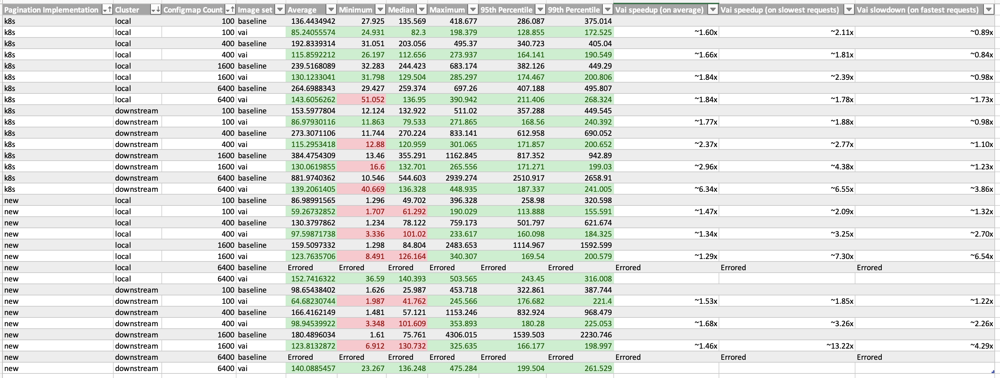

# 2023-05-03 - Steve and Vai tests, higher scale

## Results

Under test conditions, according to collected measures described below:

- vai-patched images improved *average http request duration* when listing ConfigMaps using pagination
  - **~60%-630% speedup** observed when using k8s-based pagination (`limit`/`continue`, currently used by the [dashboard](https://github.com/rancher/dashboard/) UI)
  - **~29%-68% speedup** observed when using the new Steve-cached pagination (`page`/`pagesize`)
    - **upper limit on the number of config maps**  before load-induced errors was also higher, up to 6400 10KiB ConfigMaps
  - speedups varied within ranges above depending on whether the cluster was local or downstream, and depending on the number and size of resources listed
- vai improved worst-case durations, while penalizing best-case durations, suggesting a distribution with less variance. This is consistent with expectations as vai uses an on-disk cache while current code uses an in-RAM cache, thereby penalizing the fastest case, while on the other hand needing less re-listing of resources from the Kubernetes API, thereby improving on the slowest case
- vai used less RAM (~2 GiB instead of ~10 GiB in one test). This is consistent with expectations, as vai uses an on-disk cache
- vai decreased CPU load on `kubeapi-server` (1 core in one test). This is consistent with expectations, as vai needs less re-listing of resources from the Kubernetes API

- As a side effect of this research, a [a Linux ext4 kernel bug was found and fixed](https://bugzilla.opensuse.org/show_bug.cgi?id=1210793).

## Hardware and infrastructure configuration outline

- two k3d clusters (one local and one downstream)
  - each cluster with 3 nodes (forcing etcd-based storage)
  - backing hardware: one Lenovo ThinkPad P51 laptop (circa 2017)
    - Intel(R) Core(TM) i7-7820HQ CPU @ 2.90GHz, 8 vCPUs
    - 32 GiB RAM
    - 2x SSD local storage (mdraid 0, xfs)
- k6 load generator running on another laptop on the same wired local network

## Process outline

- infrastructure setup:
  - build patched Rancher image sets
  - create a k3d cluster, install Rancher on it. Create an empty k3d downstream cluster
  - configure Rancher, import the downstream cluster
- for each patched image set:
  - swap Rancher and agent images with patched ones
  - for each test:
    - run script to generate a number of ConfigMaps
    - run load test script, record results

## Full configuration details

All infrastructure is defined in [Terraform](https://www.terraform.io/) files in the [20230503_steve_vai_tests_higher_scale](https://github.com/rancher/dartboard/tree/20230503_steve_vai_tests_higher_scale/terraform) branch.

[k6](https://k6.io) load test scripts are defined in the [k6](https://github.com/rancher/dartboard/tree/20230503_steve_vai_tests_higher_scale/k6) directory.

## Reproduction Instructions

### Requirements

- docker
- [Terraform](https://www.terraform.io/downloads)
- `git`
- `nc` (netcat)
- `make`
- [k6](https://k6.io)
- `node`

### Setup

Build patched images:
```shell
# set up build
git clone https://github.com/moio/rancher.git
cd rancher

cat >scripts/quickbuild <<"EOF"
#!/bin/bash
set -e

cd $(dirname $0)

./build
./package
EOF
chmod +x scripts/quickbuild

# build Rancher from the [moio/fix_lru_concurrent_map_write](https://github.com/moio/rancher/tree/fix_lru_concurrent_map_write) branch
git checkout fix_lru_concurrent_map_write
TAG=baseline make quickbuild

# build Rancher again from the [moio/steve-vai](https://github.com/moio/rancher/tree/steve_vai) branch
git checkout steve_vai
TAG=vai make quickbuild
```

Deploy the k3d infrastructure, install Rancher, set up clusters for tests, import built images:
```shell
# clone this project
git clone https://github.com/rancher/dartboard.git
cd scalability-tests
git checkout 20230503_steve_vai_tests_higher_scale

cd bin

./setup.mjs && ./import_images.mjs
````


All created infrastructure can be destroyed at the end of the test via:
```shell
./teardown.mjs
```

### Run tests

#### Outline
First, we create a given number of ConfigMaps in a test namespace via a k6 script. Each ConfigMap is created with 10 kb of data payload.

Then, we simulate 10 virtual users listing all ConfigMaps in that namespace via another k6 script. Each user will repeat the listing 30 times (for statistical accuracy of measures). The page size is of 100, like in the current UI. We exercise both the k8s based pagination implementation, using the `limit`/`continue` parameters and currently used by the [dashboard](https://github.com/rancher/dashboard/) UI, as well as the new Steve-cache pagination implementation using the `page`/`pagesize` parameters. We test both local and downstream cluster. Tests are repeated for `baseline` and `vai` images.

Details on tests are available in the [bin/run_test.js](https://github.com/rancher/dartboard/blob/20230503_steve_vai_tests_higher_scale/bin/run_tests.mjs) script source file.

#### Procedure

```shell
./run_tests.mjs
```

Interpreting results: the script will output one `results.csv` file with the following columns:
 * `tag`: the image tag for the test (`baseline` or `vai`)
   - `baseline` refers to Rancher 2.7.1 images with a [fix](https://github.com/rancher/steve/pull/80/) for a [race condition](https://github.com/rancher/rancher/issues/40892) discovered during this analysis
   - `vai` refers to Rancher 2.7.1 images with Vai patches
 * `count`: the number of ConfigMaps used in the test
 * `test`: filename of the k6 test that was run
   - `load_steve_k8s_pagination` refers to the k8s based pagination implementation, using the `limit`/`continue` parameters and currently used by the [dashboard](https://github.com/rancher/dashboard/)
   - `load_steve_new_pagination` refers to the new Steve-cache pagination implementation using the `page`/`pagesize` parameters
 * `cluster`: name of the tested cluster (`local` for upstream, `c-m-xxxx` for downstream)
 * `avg` average duration of http requests to retrieve a page up to 100 resources (`http_req_duration` in k6)
* `min` minimum duration of such requests
* `med` median duration of such requests
* `max` maximum duration of such requests
* `p(95)` 95th percentile - 95% of requests had a duration less than or equal to this value
* `p(99)` 99th percentile - 99% of requests had a duration less than or equal to this value
* `count` total number of requests

Full results are available in the [results.csv](https://github.com/rancher/dartboard/tree/20230503_steve_vai_tests_higher_scale/docs/20230503%20-%20steve%20vai%20test%20higher%20scale%20results/results.csv) file, summary is in the table below:


An [Excel file](https://mysuse-my.sharepoint.com/:x:/g/personal/moio_suse_com/ETkus1LxojlBm7aYWdswNX0BmmkfrQt0NET3oO6QujnNgw?e=bexG44) is  available for SUSE employees.

Observations:
- vai improved response results across the board, with higher speedups on the k8s-based pagination implementation
- vai improved worst-case durations across the board, with higher speedups on the new pagination implementation
- vai made best-case durations worse, with worse slowdown ratios on the new pagination implementation
  - however, in absolute terms, slowdown of best-case durations is much less important than the speedup of worst-case durations
  - median and percentile statistics suggest that vai request duration distribution has less variance. This is consistent with expectations as vai uses an on-disk cache while current code uses an in-RAM cache, thereby penalizing the fastest case, while on the other hand needing less re-listing of resources from the Kubernetes API, thereby improving on the slowest case
- vai could handle 6400 ConfigMaps in downstream clusters without errors, while baseline images did not

## Follow-up notes

Monitoring data should be automatically collected during tests.
