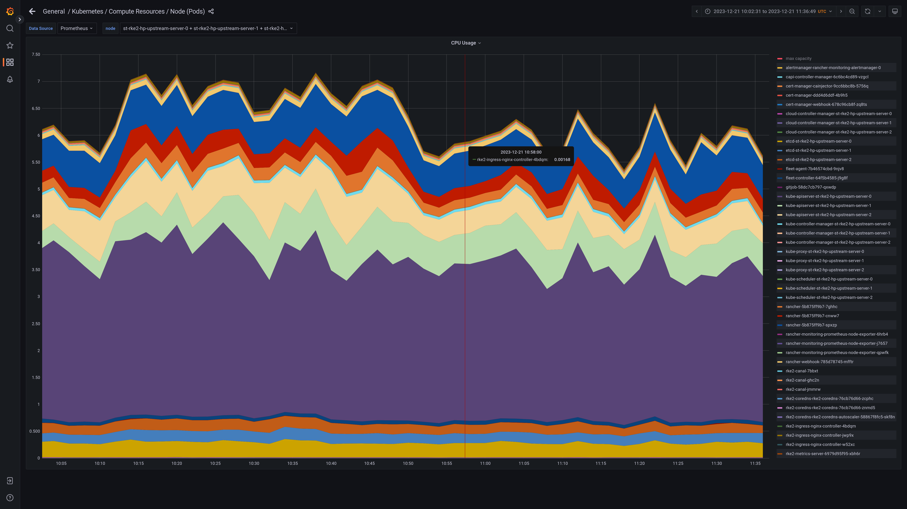
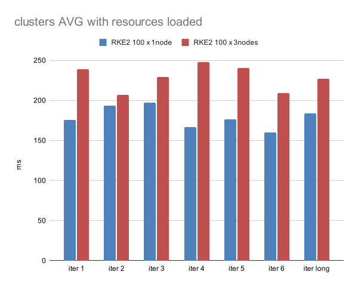
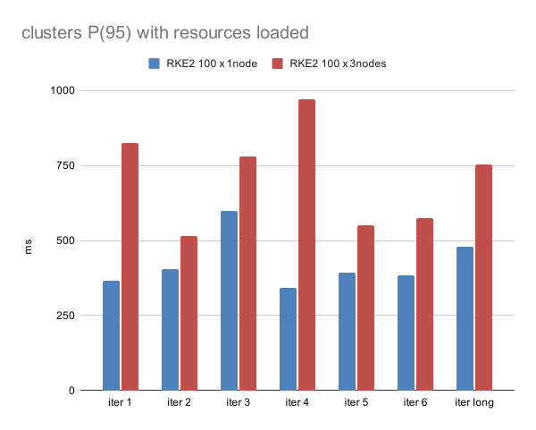

# 2023-12-01 - Performance measurements of RKE2 Rancher managing 100 downstream clusters - 1 vs 3 nodes per cluster

## Results outline

This test measures resource consumption of Rancher with 100 imported k3s clusters in two scenarios: 1 node per cluster in the first scenario, 3 nodes per cluster in the second. All tests use Azure as the infrastructure provider and RKE2 as the distribution.


Under test conditions, according to collected measures described below, increasing the number of the nodes from 1 to 3 per cluster has:
 - impacted Rancher and kubeapiserver "at rest" CPU usage
 - had slight increase in the RAM usage
 - decreased performance of the Rancher API in resource listing tests

We have observed:
* **an ~100% CPU usage increase** of the Rancher pods "at rest" (not running any user task/workload)
* **an ~20% increases in the average Rancher API response time**, and up to **~50% for the P(95) response time** in select resource listing tests
* **an ~10% increase int the overall RAM usage** of the Rancher pods

## Hardware and infrastructure configuration outline

Scenarios provisioned on Azure Cloud:

RKE2 100 x 1 node scenario:
* Rancher cluster: 1 x
    * 3 CP Nodes: `Standard_E8ads_v5` vm size (8 vCores, 64GB RAM)
    * 1 Agent Node: `Standard_E8ads_v5` (dedicated to monitoring data collection)
* Downstream clusters: 100 x
    * 1 CP Node: `Standard_B1ms` (1 vCore, 2GB RAM)
* Tester cluster: 1 x
    * 1 CP Node: `Standard_B2as_v2` (2 vCore, 8GB RAM)

RKE2 100 x 3 node scenario:
* Rancher cluster: 1 x
    * 3 CP Nodes: `Standard_E8ads_v5` vm size (8 vCores, 64GB RAM)
    * 1 Agent Node: `Standard_E8ads_v5` (dedicated to monitoring data collection)
* Downstream clusters: 100 x
    * 3 CP Nodes: `Standard_B1ms` (1 vCore, 2GB RAM)
* Tester cluster: 1 x
    * 1 CP Node: `Standard_B2as_v2` (2 vCore, 8GB RAM)

## Software configuration outline

- all hosts run the latest available openSUSE Leap 15.5 image
- Rancher cluster: Rancher 2.7.9 on a v1.24.4+rke2r1 cluster
  - loaded with: 10000 1MB ConfigMaps, 100 1MB Secrets, 200 restricted admin users, 50 projects
- downstream clusters: v1.26.9+k3s1 clusters

## Process outline
For each of the two scenarios:
* started automated infrastructure deployment, Rancher installation and Downstream cluster import
* (1) started tests and collected results
    * 6 batches (iter #1 - #6) of 30 iterations, one longer batch of 1000 iterations (iter long)
* loaded resources on Rancher cluster
* (2) started tests and collected results
    * 6 batches (iter #1 - #6) of 30 iterations, one longer batch of 1000 iterations (iter long)
    * all the batches run to retrieve 3 different resources:
        * _management.cattle.io.settings_
        * _management.cattle.io.clusters_
        * _configmaps_

## Detailed results

### CPU usage
The increased CPU usage is particularly visible when Rancher cluster is loaded with some extra resources (users, roles, projects, ConfigMaps, Secrets), bringing the total CPU usage of the 3 control plane nodes running Rancher from 3 cores to 6 cores when on idle.


_fig.1 - Core usage in the Rancher Cluster - 100 x 1 node downstream clusters_



_fig.2 - Core usage in the Rancher Cluster - 100 x 3 node downstream clusters_


The increase in the CPU usage to almost 5 cores in _fig.1_ and 7 cores in _fig.2_ is due to the start of the performance tests: the start time is at 11:25 for fig.1 and at 10:10 in _fig.2_.


Note that, in absence of resources (users, roles, projects, ConfigMaps, Secrets) the load is minimal and the CPU load varies from ~0.750 to ~0.950 cores. In those conditions, base OS processes running on the nodes have a higher CPU footprint.

You can find more screenshots of the resource usage of these two scenarios in the [100 clusters x 1 node grafana screenshots folder](https://github.com/rancher/dartboard/tree/20231222_rke2_100_clusters_1vs3_nodes_comparison/docs/20231222%20-%20RKE2%20100%20clusters%201vs3%20nodes%20comparison/grafana-screenshots/RKE4x) and in the [100 clusters x 3 nodes grafana screenshots folder](https://github.com/rancher/dartboard/tree/20231222_rke2_100_clusters_1vs3_nodes_comparison/docs/20231222%20-%20RKE2%20100%20clusters%201vs3%20nodes%20comparison/grafana-screenshots/RKE5x).


### Rancher API response time benchmarks

To test Rancher API response time, a k6 "resource listing" benchmark is run for different cluster resources under different conditions described in the [process outline section](#process-outline).

The test is repeated in presence and absence of extra resources (users, roles, projects, ConfigMaps, Secrets). We observed marked differences in the response times depending on the amount of loaded resources, especially when looking at the worst results of each batch (_max_ and _P(95)_). For more information on the _avg_, _max_, _P(95)_ and other measured values check the [interpreting results section](#interpreting-results).



_fig.3 - Average response time for the management.cattle.io.clusters resource_




_fig.4 - 95th percentile response time for the management.cattle.io.clusters resource_


The above graphs compare side by side the two scenarios (100 clusters x 1 node vs 100 clusters x 3 nodes) querying the `management.cattle.io.clusters` resource multiple times. The tests have been run seven times (_iter #_) with the last one being longer and so performing many more iterations (see the [process outline section](#process-outline) for more details).
For more results, check the available data shared in the [available data section](#available-data).


## Full configuration details

All infrastructure is defined in [Terraform](https://www.terraform.io/) files in the [20231222_rke2_100_clusters_1vs3_nodes_comparison](https://github.com/rancher/dartboard/tree/20231222_rke2_100_clusters_1vs3_nodes_comparison/terraform) branch.

[k6](https://k6.io) load test scripts are defined in the [k6](https://github.com/rancher/dartboard/tree/20231222_rke2_100_clusters_1vs3_nodes_comparison/k6) directory.

## Reproduction Instructions

### Requirements

- [Terraform](https://www.terraform.io/downloads)
- `git`
- `nc` (netcat)
- `make`
- [k6](https://k6.io)
- `node`
- `azure-cli`: (on macOS, use [Homebrew](https://brew.sh/): `brew install azure-cli`)

### Setup

Log into Azure via the CLI:
  - for SUSE employees: log into [OKTA](https://suse.okta.com), click on "Azure Landing Zone Office Portal", run `az login`

Deploy the RKE2 environment, install Rancher, set up clusters for tests:
```shell
# clone this project
git clone -b 20231222_rke2_100_clusters_1vs3_nodes_comparison https://github.com/rancher/dartboard.git
cd scalability-tests

export TERRAFORM_WORK_DIR=terraform/main/azure


./bin/setup.mjs && ./bin/run_tests.mjs
````
>[!NOTE]
>by default the branch will setup the 100 clusters x 1 node scenario: if you want to run the 100 clusters x 3 nodes one you may want to change the server_count value in the [azure configuration file](https://github.com/rancher/dartboard/blob/20231222_rke2_100_clusters_1vs3_nodes_comparison/terraform/main/azure/inputs.tf#L28) to 3 before running the /bin/setup.mjs && ./bin/run_tests.mjs command.

Once the system is provisioned, to get Rancher and clusters access info:

```shell
./bin/get_access.mjs
```


All created infrastructure can be destroyed at the end of the test via:
```shell
./bin/teardown.mjs
```

### Run tests

```shell
kubectl run -it --rm k6-manual-run --image=grafana/k6:latest --command sh
k6 run -e BASE_URL=${rancherClusterNetworkURL} -e USERNAME=admin -e PASSWORD=adminadminadmin -e RESOURCE=${resourceToTest} ./steve_paginated_api_benchmark.js
```
>[!NOTE]
>if you don't specify the _-e RESOURCE_ environment variable in the test,
_management.cattle.io.settings_ will be used.


#### Interpreting results
important output data points are:
 * `✓ checks`: number of successful checks. Presence of any errors invalidates the test
 * `http_req_duration`: duration of http requests to retrieve a page up to 100 resources
   * `avg` average duration of such requests
   * `min` minimum duration of such requests
   * `med` median duration of such requests
   * `max` maximum duration of such requests
   * `p(95)` 95th percentile - 95% of requests had a duration less than or equal to this value
   * `p(99)` 99th percentile - 99% of requests had a duration less than or equal to this value


## Available data
All the data collected from the tests is shared in the [_RKE2 100 clusters 1vs3 nodes comparison_ results directory](https://github.com/rancher/dartboard/tree/20231222_rke2_100_clusters_1vs3_nodes_comparison/docs/20231222%20-%20RKE2%20100%20clusters%201vs3%20nodes%20comparison/).
There you will find:
* a list of the deployed scenarios ([_list.txt_ file](https://github.com/rancher/dartboard/tree/20231222_rke2_100_clusters_1vs3_nodes_comparison/docs/20231222%20-%20RKE2%20100%20clusters%201vs3%20nodes%20comparison/list.txt))
* the raw data from the single tests ([_tests_raw_data_ folder](https://github.com/rancher/dartboard/tree/20231222_rke2_100_clusters_1vs3_nodes_comparison/docs/20231222%20-%20RKE2%20100%20clusters%201vs3%20nodes%20comparison/tests_raw_data))
* screenshots from a Grafana dashboard showing CPU and Memory usage from the tested scenarios ([_grafana-screenshots_ folder](https://github.com/rancher/dartboard/tree/20231222_rke2_100_clusters_1vs3_nodes_comparison/docs/20231222%20-%20RKE2%20100%20clusters%201vs3%20nodes%20comparison/grafana-screenshots))
* an [OpenDocument spreadsheet](https://github.com/rancher/dartboard/tree/20231222_rke2_100_clusters_1vs3_nodes_comparison/docs/20231222%20-%20RKE2%20100%20clusters%201vs3%20nodes%20comparison/scalability_tests_summary.ods) containing all the results with few graphs
