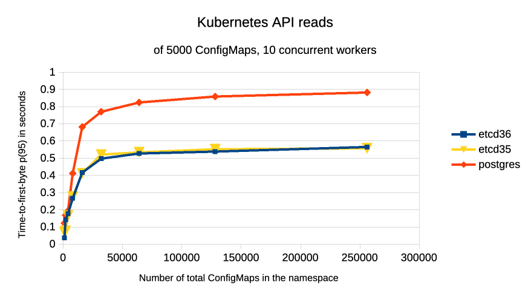
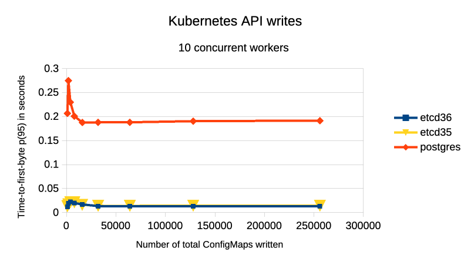

# 2023-05-13 - Comparison between etcd and Postgres via kine for kubeapiserver performance

## Results outline

This stress test measures http request time on creation and listing of ConfigMaps through the Kubernetes API, focusing on the difference in performance between a 3-node etcd-backed cluster and a 1-node kine/Postgres-backed one on identical hardware.

Under test conditions, according to collected measures described below, we have observed:
* **~1.5x faster performance for etcd in list operations in comparison to Postgres** on most tested data sizes, and
* **>10x faster performance for etcd in create operations in comparison to Postgres** on most tested data sizes

## Hardware and infrastructure configuration outline

Scenarios provisioned on AWS:

* Rancher cluster:
    * 3 CP Nodes: `i3.xlarge` instances (4 vCPUs, 30GB RAM)
    * 1 Agent Node: `i3.xlarge` instances (4 vCPUs, 30GB RAM)

* For etcd:
    * 3 Nodes: `m6id.4xlarge` instances (16 vCPUs, 64GB RAM, dedicated 950 GB NVMe SSD)

* For Postgres:
    * 1 Node: `m6id.4xlarge` instance (16 vCPUs, 64GB RAM, dedicated 950 GB NVMe SSD)

An HA configuration for Posgres is not part of this test, however, it can be assumed any multi-node setup can only make Postgres slower in write performance. Reads could be slower or faster depending on setup.

## Software configuration outline

- all hosts run the latest available openSUSE Leap 15.6 image
- Rancher cluster: Rancher 2.11.1 on RKE2 v1.32.4
  - loaded with: 1000 to 256000 small (4-byte data) ConfigMaps

## Process outline
For each of the two scenarios:
* automated infrastructure deployment, Rancher installation
* automated test execution: benchmarked creation of ConfigMaps, wait time for settlement, read warmup and read benchmark
* semi-automated analysis of results

## Detailed results





The above graphs compare etcd 3.5, 3.6 and Postgres on the p(95) of kube-apiserver http response times.

Full results are available in the folder [20250513 - Kubernetes API benchmark test results](20250513%20-%20Kubernetes%20API%20benchmark%20test%20results).

A [spreadsheet](https://drive.google.com/file/d/12_pP2iqarnGgXdV5qRs7fbAjTAZPiA1q/view?usp=sharing) is  available for SUSE employees.


## Full configuration details

All infrastructure is defined by the [aws_dedicated_etcd.yaml](../darts/aws_dedicated_etcd.yaml) and [aws_kine_postgres.yaml](../darts/aws_kine_postgres.yaml) dart files and accompanying [OpenTofu](https://opentofu.org/) files in the [20250513_kubernetes_api_benchmark](https://github.com/rancher/dartboard/tree/20250513_kubernetes_api_benchmark) branch.

[k6](https://k6.io) load test scripts are defined in the [k6](../k6) directory.

Utility scripts that orchestrate load tests are defined in the [util](../util) directory.

## Reproduction Instructions

### Requirements

Same as dartboard and the AWS CLI tool.

### Setup

Log into AWS via the CLI:
  - for SUSE employees: log into [OKTA](https://suse.okta.com), click on "AWS Landing Zone", retrieve the profile name, then use `aws sso login --profile AWSPowerUserAccess-<IDENTIFIER>`

Deploy the environment, install Rancher, set up clusters for tests:
```shell
# clone this project
git clone -b 20250513_kubernetes_api_benchmark https://github.com/rancher/dartboard.git
cd dartboard

# edit the AWSPowerUserAccess identifier
vim darts/aws_kine_postgres.yaml

make

./dartboard -d ./darts/aws_kine_postgres.yaml deploy
````

### Run tests

Once the system is provisioned, open a `k6` shell and pod on the tester cluster:
```shell
cd util
sh k6_shell.sh
```

Copypaste running instructions in the k6 shell terminal taken and edited from `util/test_runner.sh`.

At the end of the run, copy result files out of the container from another shell:

```shell
kubectl cp -n tester k6shell:/home/k6/results /path/to/results
```

#### Interpreting results
important output data points are:
 * `✓ checks`: number of successful checks. Presence of any errors invalidates the test
 * `http_req_duration`: duration of http requests to retrieve a page up to 100 resources
   * `avg` average duration of such requests
   * `min` minimum duration of such requests
   * `med` median duration of such requests
   * `max` maximum duration of such requests
   * `p(95)` 95th percentile - 95% of requests had a duration less than or equal to this value
   * `p(99)` 99th percentile - 99% of requests had a duration less than or equal to this value
